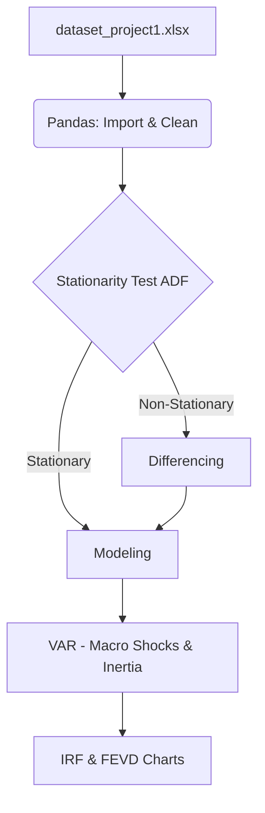

# System Architecture
# Vietnam Inflation Forecast Project

## 1. Architectural Overview

Unlike complex cloud-based architectures, this project focuses on a streamlined, local data science workflow. The architecture is designed for reproducibility and academic rigor, processing an Excel dataset through a Python pipeline.

## 2. Pipeline Layers

### 2.1 Data Ingestion Layer
- **Input:** Single Excel file (`data/dataset_project1.xlsx`).
- **Tool:** `pandas.read_excel()`
- **Structure:** 11 macroeconomic variables across 4 pillars.

### 2.2 Preprocessing & Transformation Layer
- **Handling Missing Data:** Linear interpolation or forward-fill for gaps in `domestic_credit_index` and `lending_interest_percent`.
- **Indexing:** Conversion of the `years` column into a Pandas Time Series Index.
- **Stationarity Transformation:** First-order or log differencing applied based on the Augmented Dickey-Fuller (ADF) test results.

### 2.3 Analytics & Modeling Layer
- **Modeling Path:** 
  - `statsmodels.tsa.vector_ar.var_model.VAR`
  - Purpose: Cross-variable shock analysis (IRF, FEVD) and inertia measurement.

### 2.4 Presentation Layer
- **Tools:** `matplotlib.pyplot`, `seaborn`
- **Output:** In-notebook visualizations of forecast trajectories, ACF/PACF diagnostics, and IRF grids.

## 3. Data Flow Diagram

