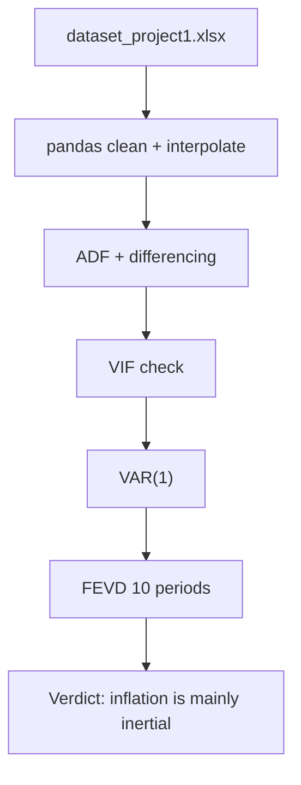

# System Architecture

## Minimal Local Pipeline

## Implementation

- Notebook source: `src/generate_notebook.py`
- Generated notebook: `src/Project1_DAAN_v2.ipynb`
- Dashboard: `src/dashboard`
- Data: `data/dataset_project1.xlsx`

The dashboard and report must follow the same flow as the notebook and avoid unrelated analysis sections.
